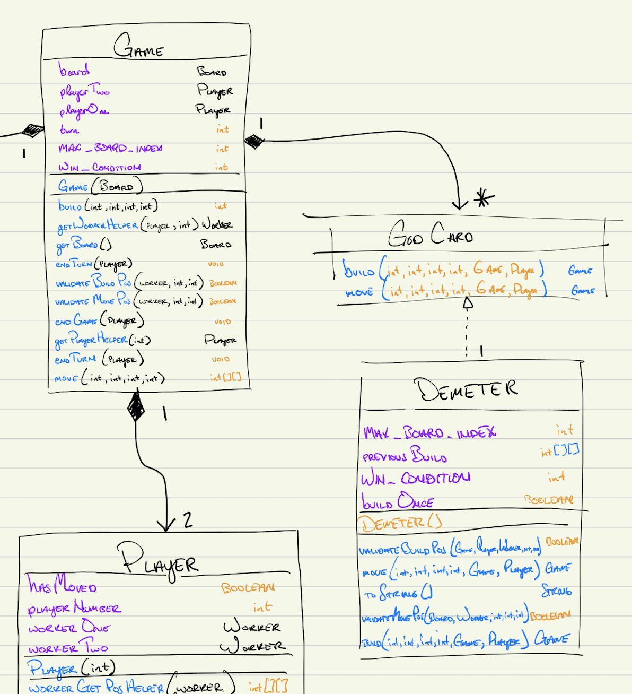

Task 3: Justification
Write a short report to answer the following questions to justify your design choices. You should refer to design goals, principles, and patterns in your answers where appropriate. You should also embed the object-level interaction diagram and the object model to backup your explanation in your text. Note that you only need to give the necessary parts of the diagram to illustrate your idea instead of giving a complete diagram. Turn this in as justification.pdf or justification.md.

How can a player interact with the game? What are the possible actions? Please include necessary parts of the Object Model to explain.

    game.move(int playerNum, int workerNum, int x, int y)
The game.move() function grants the user the ability to interact with the game.Board and game.Space classes with the board.getSpace() method, using the .vacate() and .occupy() functions. Additionally, this affords the user the ability to interact with the game.Player class, calling the p.hasMoved() method.

    game.build(int playerNum, int workerNum, int x, int y)
The game.build() function grants the user the ability to interact with the game.Board and game.Space classes, with the buildTower() method called on the game.Space class. The player may also interact with the game.Player class, calling a variety of methods that assist in setting and getting worker positions.
=======
- A player can interact with the game through:
* game.move(int playerNum, int workerNum, int x, int y)
- The game.move() function grants the user the ability to interact with the Board and Space classes with the board.getSpace() method, using the .vacate() and .occupy() functions. Additionally, this affords the user the ability to interact with the Player class, calling the p.hasMoved() method.
* game.build(int playerNum, int workerNum, int x, int y)
- The game.build() function grants the user the ability to interact with the Board and Space classes, with the buildTower() method called on the Space class. The player may also interact with the Player class, calling a variety of methods that assist in setting and getting worker positions.

What state does the game need to store? And where should is be stored? Please include necessary parts of the Object Model to explain.

- The game needs to store the following:
* an instance of the board
* instances of playerOne and playerTwo
* as well as whose turn it is

How does the game determine what is a valid build (either a normal block or a dome) and how does the game perform the build? Please include necessary parts of an object-level Interaction Diagram and the Object Model to explain.

- The game takes the location and validates the build on several different conditional factors. 

These are stored within the game.game class. I opted to have my game.game class store these variables as I was operating under a controller heuristic. In order for the game.game class to function properly, it needs the ability to properly call the move and build functions. I was able to abstract various parts of this process by including helper functions within the game.game class that granted access to objects that ended up being necessary based on my implementation.

Without access to the turn variable, my game.game class would not be able to validate player and worker moves. It is necessary to have access to the turn field to ensure that players are properly making moves, and not operating out of turn.

My game needs access to the board class to pass the initial constructor through to set up the game. The game class does this by calling the board constructor, which is initalized with spaces from the game.Space class.

# How does the game determine what is a valid build (either a normal block or a dome) and how does the game perform the build? Please include necessary parts of an object-level Interaction Diagram and the Object Model to explain.

The game takes the location and validates the build on many conditional factors. From the Java Documentation, we have the following data validation calls:

    First conditional checks if buildPos is on the board.
    Second conditional checks if x coordinate is adjacent to game.Worker.
    Third conditional checks if y coordinate is adjacent to game.Worker.
    Fourth conditional checks if game.Space has room to build.
    Fifth conditional checks if game.Space is occupied.
    Sixth conditional checks if game.Space is game.Worker's current space.
    Seventh conditional checks if it is the game.Player's turn.
    Eighth conditional checks if the game.Player has moved.
    Ninth conditional checks if the game.Worker building is the game.Worker that has moved.

This was easily the trickiest functionality to implement, and required extensive documentation to adequately represent in UML fashion. There are definitely better ways to do this. My final diagram does not match what my initial diagram looked like. The call to my data validation method ended up touching most classes in this project. I recgonize this is a questionable design choice. My justification for this decision lies in the fact that I am implementing the controller heuristic within the game.game class. My game.game class touches most objects, but this affords me the opportunity to minimize coupling between other classes. 
 
I perceive it to be an advantageous design that I chose not to implement blocks and domes. Utilizing the towerHeight field within the game.Space class, I am able to determine when and how to build, move workers, and how to handle other tower and dome related activity. This could prove to be disadvantageous should God Cards allow for domes to be placed on towers with a height less than 3. In the event this is not the case, then this implementation should not prove to be problematic. By utilizing only a private field of towerHeight, I am able to improve the cohesion of my build.

=======
- My design helps solve the issue of extensibility of including additional God cards by providing a God Card interface and a God Card package. All one needs to do is create a new God Card within the God Card package and override the default build and move methods, and then

  - I chose not to include methods within my interface for validateBuildPos and validateMovePos, because these may vary from GodCard to GodCard. In this course, we have learned that for API's - "when in doubt, leave it out." I feel this incorporates design principles that we have learned in this course.
  - I considered hard coding each God within the Game class, but this would not allow the game to be extensible. Every new God Card would have to be added with a new, complex series of if/else statements. This is the opposite of what the course is trying to teach us, and we would fall into the "GodClass" anti-pattern.
  - I also considered using the Decorator pattern by extending the Player or Worker class to allow for inheritance of God Card methods and God-specific behavior. This would have worked, but it would have increased coupling and reduced cohesion.

What design pattern(s) did you use in your application and why did you use them? If you didn't use any design pattern, why not? 

- I used the Strategy Pattern. Each God Card is a Strategy. The god cards we have been tasked to implement all have different build() and move() methods. These build() and move() methods implement different algorithms. When our goal is to implement different algorithms based on stateful conditions, the Strategy Pattern is a great candidate to assist in solving the problem. My Game class is responsible for instantiating the God Cards and assigning these strategies to the Worker class. The God Cards (strategies) handle the unique algorithms that must be executed based on the game's specific state.

